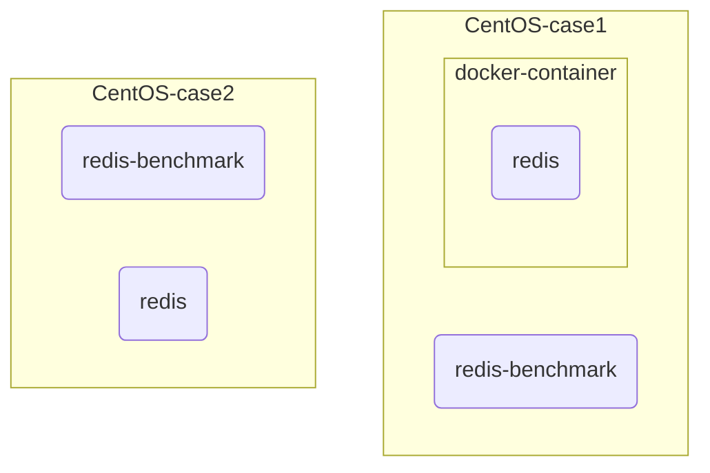
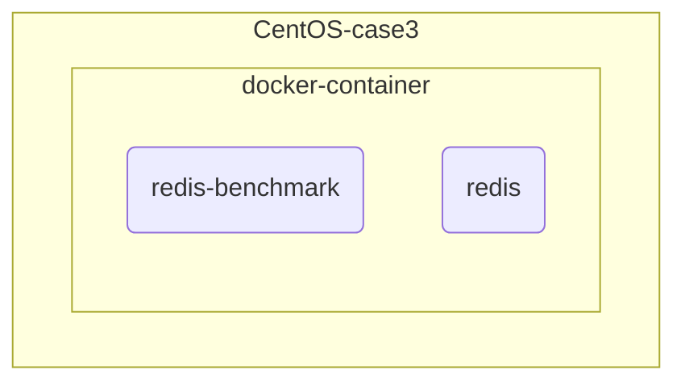

redis 在docker中慢的原因分析

# 起因

本来想实际测试一下mysql和redis到底差了多少, 按10w次, 发现mysql 用了18s,  redis 用了15s,这不合理啊, 分析下原因, 确定是docker下跑redis的原因

[和这个问题是一样的](https://stackoverflow.com/questions/21691540/how-to-optimize-performance-for-a-docker-container)

# 现象(redis 版本6.2.6)

## 直接在系统内跑redis

#### windows -> 5w 

```
C:\redis>redis-benchmark -t get -p 6379 -n 100000 -q
GET: 49925.11 requests per second
```

#### centos(virtualbox) -> 10w

```
[root@localhost ~]# redis-benchmark -t get -h 192.168.56.101 -p 6379 -n 100000 -q
GET: 104712.05 requests per second
```

#### centos2 -> 10w

```
[root@pm-hw-hy ~]# redis-benchmark -t get -n 100000 -q
GET: 109769.48 requests per second
```

#### macos ->10w

```
parapeng@localhost Homebrew % redis-benchmark -n 100000  -q -t set
SET: 101832.99 requests per second, p50=0.119 msec
```


注意不能使用redis不能使用 127.0.0.1 要使用0.0.0.0, 否则会导致外网不能连接redis

## 在docker中运行redis

```
docker run -d --name redis-host  --net=host -p 6380:6380 redis
```

### 在容器内跑:

#### centos(virtualbox) ->3.3w

```
[root@localhost ~]#  docker exec -it 8c bash
root@8ca803e40423:/data# redis-benchmark -t get -p 6379 -n 100000 -q
GET: 33863.87 requests per second, p50=0.703 msec 
```

#### centos2->3.3w

```
[root@pm-hw-hy ~]# docker exec -it 10 bash
root@10357b39a9a9:/data# redis-benchmark -t get -n 100000 -q
GET: 36982.25 requests per second, p50=0.671 msec
```

#### macos->8w

```
docker exec -it fd /bin/sh
# redis-benchmark -t get -p 6379 -n 100000 -q
GET: 80128.20 requests per second, p50=0.311 msec    
```

### 在容器外跑:

#### macos->1w

```
parapeng@localhost ~ % redis-benchmark -n 100000 -q -t set 
SET: 11164.45 requests per second, p50=3.439 msec 
```

#### centos1->9.8w

```
[root@localhost ~]# redis-benchmark -t get  -n 100000  -q
GET: 98911.96 requests per second
```

#### centos2->10w

```
[root@pm-hw-hy ~]# redis-benchmark -t get -n 100000 -q
GET: 104493.20 requests per second
```

### 在虚拟机外跑

### centos  -> 2w

```
C:\redis>redis-benchmark -t get -h 192.168.56.101 -p 6379 -n 100000 -q
GET: 22471.91 requests per second
```

## 为什么在docker-contianer内测会和直接在系统下测会有差别?

macos 下原本的10w在docker内只剩8w

centos 下更是从10w剩了3w

## 为什么docker-container内外测会有差别?

macos 从8w->2w

centos 从3w反而升到了8w

## 为什么虚拟机内差这么多?

和[这里](https://stackoverflow.com/questions/21691540/how-to-optimize-performance-for-a-docker-container)说的一样是网络问题

#### 虚拟机使用桥接模式 ->3W

```
C:\redis>redis-benchmark -t get -h 172.16.0.181 -p 6379 -n 100000 -q
GET: 31715.82 requests per second
```

#### 虚拟机使用host-only ->2W

```
C:\redis>redis-benchmark -t get -h 192.168.56.101 -p 6379 -n 100000 -q
GET: 23679.85 requests per second
```

#### 虚拟机使用网络地址转换(Net) ->1W

此时添加端口转发 6379:6379

```
C:\redis>redis-benchmark -t get -p 6379 -n 100000 -q
GET: 13232.76 requests per second
```


stackoverflow


# Why redis-benchmark running inside a docker-container is slower than running outside a container

i read [it](https://stackoverflow.com/questions/21691540/how-to-optimize-performance-for-a-docker-container), which say "With same redis-benchmark, redis-server runs inside a container much slower, than run on hosted OS", it like:



Case 1 is slower than case 2, but not by much:

case1->10.9w:

```
[root@pm-hw-hy ~]# redis-benchmark -t get -n 100000 -q
GET: 109769.48 requests per second
```

case2->10.4w:

```
[root@pm-hw-hy ~]# redis-benchmark -t get -n 100000 -q
GET: 104493.20 requests per second
```

But in this case:



case3:

```
[root@pm-hw-hy ~]# docker exec -it 10 bash
root@10357b39a9a9:/data# redis-benchmark -t get -n 100000 -q
GET: 36982.25 requests per second, p50=0.671 msec
```

it drop rapidly to 3.6w, I'm so confused, if i run redis in docker, why redis-benchmark runing in docker-container(case3)  is slower than redis-benchmark runing in centos(case1)

 I'm afraid it's a computer problem, I did above cases again on the cloud server,it's same result :

case2 (centos cloud server) -> 10w

```
[root@pm-hw-hy ~]# redis-benchmark -t get -n 100000 -q
GET: 109769.48 requests per second
```

case 1(centos cloud server) ->9.8w

```
[root@localhost ~]# redis-benchmark -t get  -n 100000  -q
GET: 98911.96 requests per second
```

case3(centos cloud server) ->3.6 w

```
[root@pm-hw-hy ~]# docker exec -it 10 bash
root@10357b39a9a9:/data# redis-benchmark -t get -n 100000 -q
GET: 36982.25 requests per second, p50=0.671 msec
```

I still don't believe this result, i run it in macos

case2 (macos) -> 10w

```
parapeng@localhost Homebrew % redis-benchmark -n 100000  -q -t set
SET: 101832.99 requests per second, p50=0.119 msec
```

case 1(macos) ->1w

```
parapeng@localhost ~ % redis-benchmark -n 100000 -q -t set 
SET: 11164.45 requests per second, p50=3.439 msec 
```

case3(macos) ->8w

```
docker exec -it fd /bin/sh
# redis-benchmark -t get -p 6379 -n 100000 -q
GET: 80128.20 requests per second, p50=0.311 msec   
```

This is my expected result:

case2 is slower than case3 because docker-network

case3 is slower than case2 because docker-contianer


who can help me answer, tks:

1. case3 has less network than case2, why centos case3(3.6w) is slower than case2(10w)?

2. why centos and   macos  results are different


