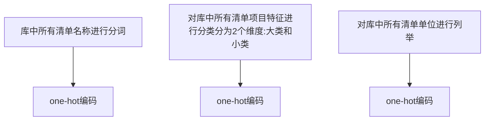
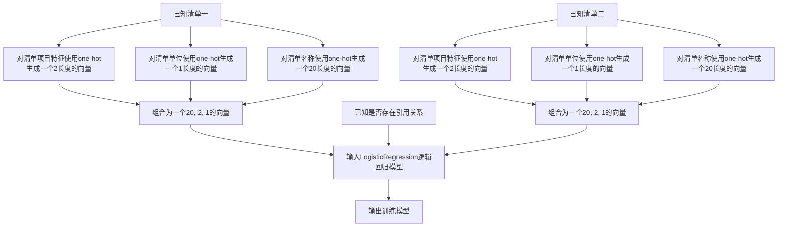
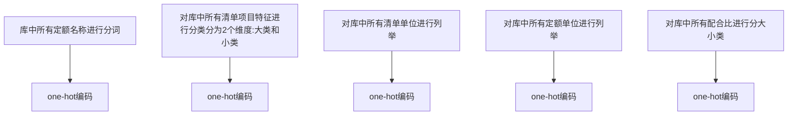
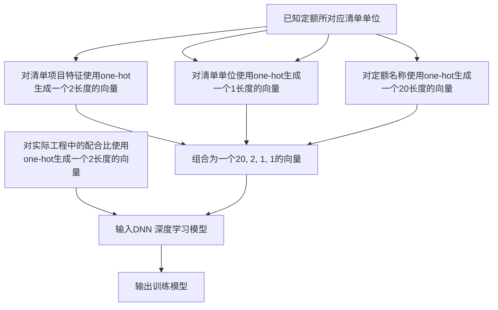

# 自动匹配单价引用

**技术领域**

人工智能和工程造价的(自动匹配单价引用)组合应用

**背景技术**

+ 数据的清洗整理和Onehot处理
+ LogisticRegression(逻辑回归)

**发明内容**

用户户在导入工程之后,需手动对清单定额进行单价引用以达到多条清单同步价格的目的,该技术可以部分代替用户输入,自动对多条清单的同步单价关系自动关联

**附图**


**具体实施方式**

##### 综述

首先通过对清单的内容进行过滤清洗和分词,对清单中的名称规格等进行one-hot编码及向量化,建立逻辑回归模型,输入不同清单的向量,和实际清单之间的引用关系, 预测输入清单和现有清单之间的引用关系.

##### 数据清洗和处理

通过已有的工程监理数据库, 该数据库包含清单单价引用的信息和清单对应的信息.

+ 针对清单名称:

首先对库中所有句子进行分词(并检查), 然后对词语进行 one-hot编码.对于输入的清单名称同样先分词, 然后通过one-hot编码把词语变为一个限制为20个长度的向量,

+ 针对清单的项目特征/单位:

统计后归纳为几百个特征, 并对数据进行清理, 分为N个大类, 每个大类下有不同的小类, 分别对他们做one-hot编码, 并合并为一个二维向量 

+ 单位同样做为有一维向量 
+ 合并为一个(20, 2, 1) 对应的内容为(名称, 项目分类, 单位)的向量

##### 模型的生成和训练

生成一个LogisticRegression(逻辑回归模型)

组合清单名称的向量和清单项目特征的向量为(20, 2, 1) 的向量作为训练输入

设置第一条清单的向量为训练输入一,设置第二条清单的向量为训练输入二

输入两条清单的引用关系作为训练输出.

训练该模型.

##### 预测与应用

输入预测清单和现有清单, 预测他们之间是否存在引用关系


数据清洗



模型训练



模型应用

````mermaid
graph TD
a[已知清单一]-->b[对清单名称使用one-hot生成一个20长度的向量]
a[已知清单一]-->c[对清单项目特征使用one-hot生成一个2长度的向量]
a[已知清单一]-->d[对清单单位使用one-hot生成一个1长度的向量]
c-->e[组合为一个20, 2, 1的向量]
d-->e
b-->e

a2[已知清单二]-->b2[对清单名称使用one-hot生成一个20长度的向量]
a2[已知清单二]-->c2[对清单项目特征使用one-hot生成一个2长度的向量]
a2[已知清单二]-->d2[对清单单位使用one-hot生成一个1长度的向量]
c2-->e2[组合为一个20, 2, 1的向量]
d2-->e2
b2-->e2

e-->g
e2-->g[输入LogisticRegression逻辑回归模型]
g-->h[输出是否存在引用关系]
````


# 自动推荐配合比

**技术领域**

人工智能和工程造价功能(自动推荐配合比)之间的组合应用

**背景技术**

+ 数据的清洗整理和Onehot处理

+ DNN

**发明内容**

用户在已有清单中套定额时,当定额下存在配合比时,需手动选择对应的配合比.通过该方法可以自动帮助客户选择相对正确的配合比

**附图**

**具体实施方式**

综述

由于套定额时配合比的选择工程量清单的内容有关.通过录入或导入好的清单数据,对清单的内容进行智能分词并自动提取匹配配置库中的关键字,首先使用用户习惯进行第一轮分析推荐，当分析出多选项时，再结合大数据库使用分布概率分析出使用概率最大的选项，推荐最大概率使用的配合比。

##### 数据清洗和处理

通过已有的工程监理数据库, 该数据库包含清单单价引用的信息和清单对应的信息.

+ 针对清单名称:

首先对库中所有句子进行分词(并检查), 然后对词语进行 one-hot编码.对于输入的定额名称同样先分词, 然后通过one-hot编码把词语变为一个限制为20个长度的向量,

+ 针对清单的项目特征/定额单位:

统计后归纳为几百个特征, 并对数据进行清理, 分为N个大类, 每个大类下有不同的小类, 分别对他们做one-hot编码, 并合并为一个二维向量 

+ 定额单位同样做为有一维向量 
+ 合并为一个(20, 2, 1, 1) 的向量对应的内容为(定额名称, 清单项目分类, 定额单位, 清单单位)
+ 针对配合比, 列出所有的配合比的大类和小类,如纯混凝土和泵用纯混凝土是两个大类, "泵用纯混凝土C15 42.5 " 和 "泵用纯混凝土C20 42.5 2"是两个小类, 用是对库中的所有配合比做数据清洗和onehot化为一个二维向量(配合比大类, 配合比小类)

##### 模型的生成和训练

生成一个DNN模型,设置32个隐藏层.

组合定额名称的向量和清单项目特征的向量为(20, 2, 1, 1) 的向量作为训练输入

输入对应定额选择的配合比(配合比大类, 配合比小类)为训练输出.

训练该模型.

##### 预测与应用

输入预测定额及他所属的清单, 预测其配合比是属于哪一大类和哪一小类.


数据清洗



模型训练



模型应用

````mermaid
graph TD
a[已知定额名称]-->b[对定额名称使用one-hot生成一个20长度的向量]
a[已知定额所对应清单项目特征]-->c[对清单项目特征使用one-hot生成一个2长度的向量]
a[已知定额单位]-->d[对定额单位使用one-hot生成一个1长度的向量]
a[已知定额所对应清单单位]-->d[对清单单位使用one-hot生成一个1长度的向量]
c-->e[组合为一个20, 2, 1, 1的向量]
d-->e
b-->e

e-->g[输入DNN 深度学习模型]
g-->h[输出对应的配合比]
h-->对结果进行softmax处理,防止越界
````